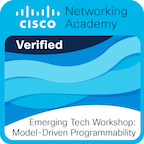

### Last posts from [blog](https://vostbur.github.io):

  - [Snippet for printing a subclass tree
](https://vostbur.github.io/posts/snippet-printing-subclass-tree/)
  - [Starting a production Django server
](https://vostbur.github.io/posts/starting-prod-django-server/)
  - [Starting a Synapse/Matrix server on Raspberry Pi
](https://vostbur.github.io/posts/starting-matrix-server-raspberry-pi/)
  - [Starting a remote docker development server on DigitalOcean droplet
](https://vostbur.github.io/posts/starting-remote-docker-dev-server/)
  - [How to push to GitHub via HTTPS if you have enabled two-factor authentication
](https://vostbur.github.io/posts/push-github-two-factor-auth/)
  - [The first acquaintance with the Cisco DevNet Sandbox
](https://vostbur.github.io/posts/first-acquaintance-with-cisco-devnet-sandbox/)
  - [A dynamic GitHub profile with GitHub Actions
](https://vostbur.github.io/posts/dynamic-github-profile-with-github-actions/)
  - [Deploying the django app on the DigitalOcean App Platform
](https://vostbur.github.io/posts/django-on-digitalocean-app-platform/)
  - [Запуск CSR1000v в VirtualBox и VMware
](https://vostbur.github.io/posts/csr-virtualbox-vmware/)
  - [Запуск CSR1000v в VirtualBox (Windows) с эмуляцией serial port
](https://vostbur.github.io/posts/csr-virtualbox-serial-port-emulation/)
